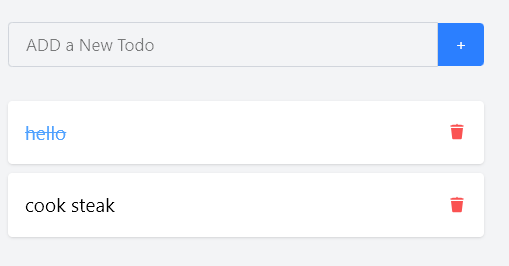

###https://tathagat.hashnode.dev/building-a-todo-app-with-mern-stack-using-mvc-architecture-a-step-by-step-guide

frontend: React, tailwindcs, javascript.
npm run dev

backend: Node.js, Express and MongoDB (local).
npm start
